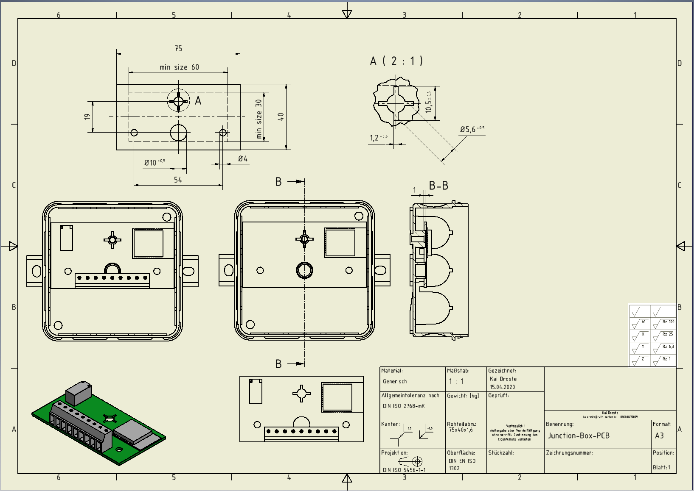
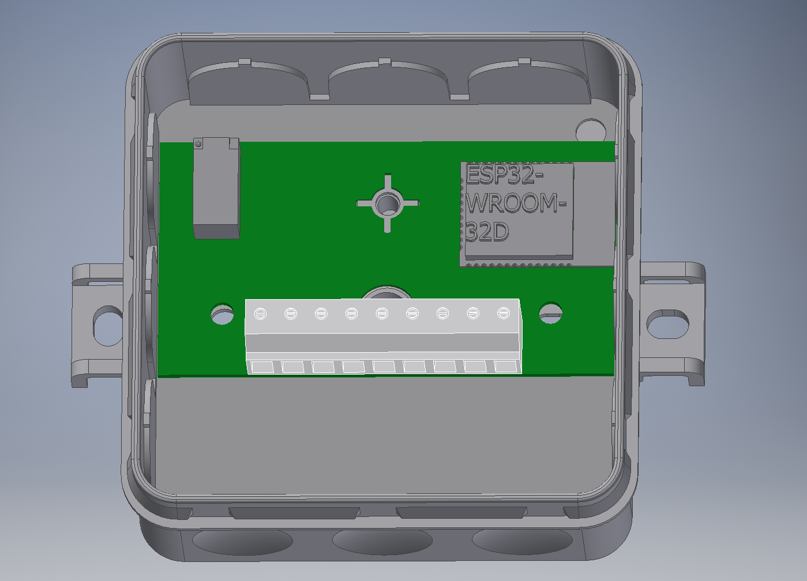
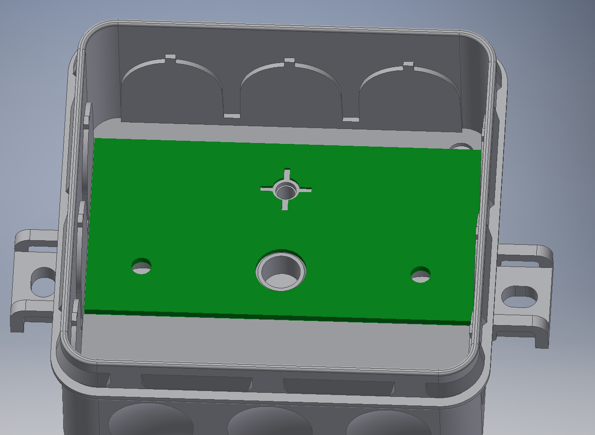

# iot analog io interface

This repository entails the specifications and PCB design of a gateway communicating with 0-10 V and 0-20 mA devices. 

**Specifications:**
*  Case:
    * [Datasheet](Datasheet/M-2K-12_V1.pdf)
    * outer dimensions: 85 x 85 x 37 mm 
    * inner dimensions: 73 x 73 x 25 mm
    * [PCB-Measurements:](Datasheet/Junction-Box-PCB.pdf) 75 x 40 x 1.6 mm 
    

*  Components: 
    * ESP32-WROOM-32D(4MB)
    * Header Pins for flashing bridge [ESP-Prog](https://github.com/espressif/esp-iot-solution/blob/master/documents/evaluation_boards/ESP-Prog_guide_en.md)
    * Reset Button (EN)
    * Status / Debugging LED
    * DC-DC Buck Converter: VXO7805-500-M-TR [Mouser-Link](https://eu.mouser.com/ProductDetail/CUI-Inc/VXO7805-500-M-TR?qs=sGAEpiMZZMt6Q9lZSPl3RZu8fUE7mF8DJ%252B7zlX5ibsh2kpXM%252BaAGeA%3D%3D)  
    * LDO 5V-3.3V: REG1117-3.3/2K5 [Mouser-Link](https://eu.mouser.com/ProductDetail/Texas-Instruments/REG1117-33-2K5?qs=sGAEpiMZZMsGz1a6aV8DcPcE8PQMIP6nFtEQH10LxDo%3D)
       
    * ADC/DAC as external circuit 
        * ADC
            * 0-10 V
            * resolution 10 bit 
    * XTR111 Voltage to current Converter [Mouser-Link](https://www.mouser.de/ProductDetail/Texas-Instruments/XTR111AIDGQR?qs=sGAEpiMZZMsLZKpoLkeUsYOEE%252Bg3HwFQLgo3KShyU5w%3D)
    * header with jumper to set current or voltage mode
*  Additional components:
    * Double relay switch
    * Connector: 9 Position Screw Terminal 
        * [TB001-500-09BE](https://www.mouser.de/ProductDetailCUI-Devices/TB001-500-09BEqs=sGAEpiMZZMvPvGwLNS671%2FDanv8Jav06pFwBruE7rNiHV5dcUdCoOg%3D3D)
        * [Datasheet](Datasheet/tb001-500-1550615.pdf)
    * 2x6 pin header: M20-9760346 [Mouser-Link](https://eu.mouser.com/ProductDetail/Harwin/M20-9760346?qs=sGAEpiMZZMs%252BGHln7q6pmzlZUuX%2F53qjFNOh3aK0cf8%3D)

*  IOs:
1. 24 VDC (input, supply gateway)
2. GND (input, supply gateway)
3. 24 VDC (output, supply sensor/actuator device)
4. GND (output, sensor/actuator device)
5. 0-10 VDC / 0-20 mA (switched by jumper) (feedback signal from sensor/actuator device)
6. 0-10 VDC / 0-20 mA (switched by jumper) (feedback signal from sensor/actuator device forwarding to PLC)
7. 0-10 VDC / 0-20 mA (switched by jumper) (set point signal to sensor/actuator device forwarding from PLC)
8. 0-10 VDC / 0-20 mA (switched by jumper) (set point signal to sensor/actuator device)
9. 24 VDC (input for relay switch from PLC)

## TODO:
- [x] Housing
	- [x] Measurements
	- [x] Mounting Holes

## Example board layout:

