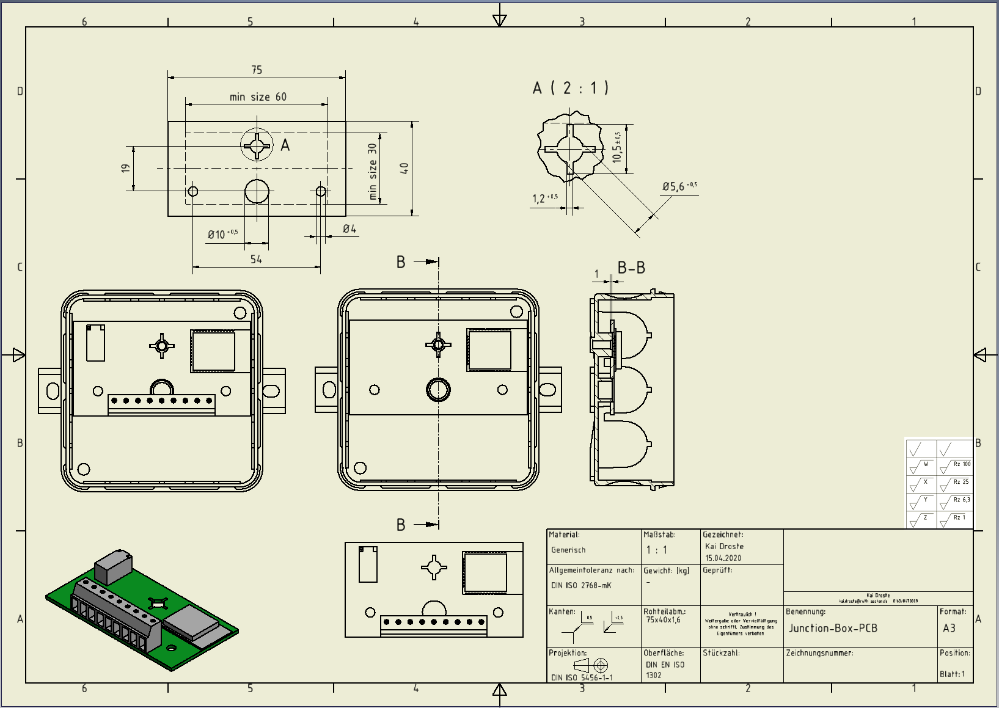
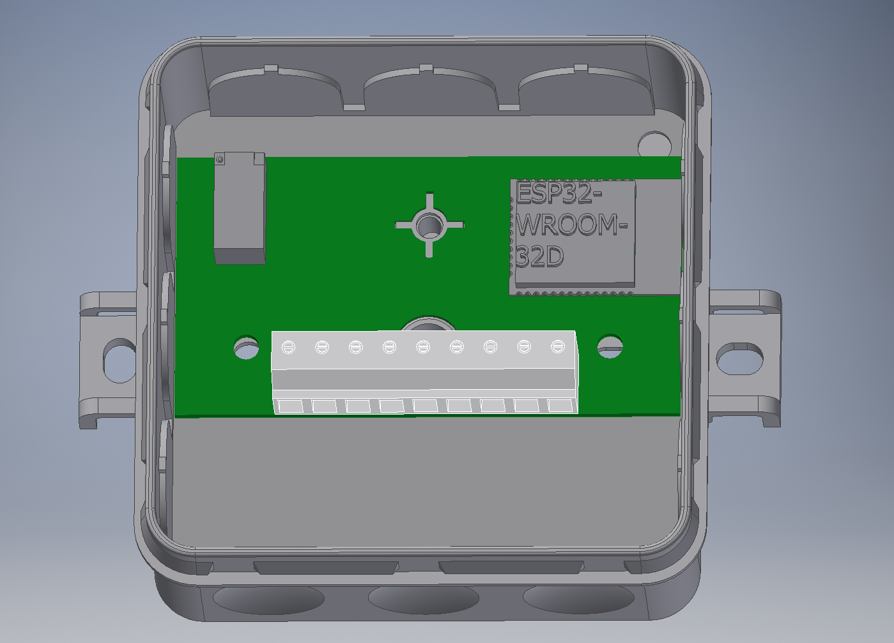
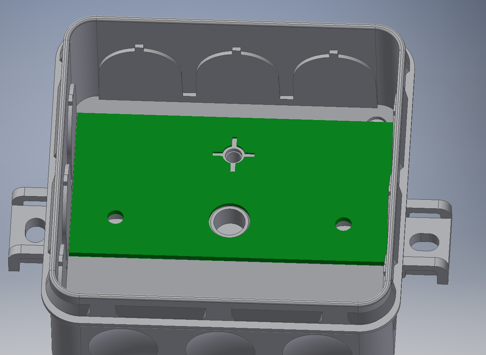

# iot_rs485

This repository entails the specifications and PCB design of a gateway communicating with devices via Modbus RTU or BACnet MS/TP.

**Specifications:**
*  Battery: None
*  Case:
    * [Datasheet](Datasheet/M-2K-12_V1.pdf)
    * outer dimensions: 85 x 85 x 37 mm 
    * inner dimensions: 73 x 73 x 25 mm
    * [PCB-Measurements:](Datasheet/Junction-Box-PCB.pdf) 75 x 40 x 1.6 mm 
    

*  Components: 
    * ESP32-WROOM-32D(16MB)
    * Header Pins for flashing bridge [ESP-Prog](https://github.com/espressif/esp-iot-solution/blob/master/documents/evaluation_boards/ESP-Prog_guide_en.md)
    * UART TTL to RS485 converter (Maybe BACnet needs an own gateway with a card reader? Needs to be tested)
        * Modbus-RTU
        * BACnet MS/TP
*  Additional components:
    * Double relay switch
    * Connector: 9 Position Screw Terminal 
        * [TB001-500-09BE](https://www.mouser.de/ProductDetail/CUI-Devices/TB001-500-09BE?qs=sGAEpiMZZMvPvGwLNS671%2FDanv8Jav06pFwBruE7rNiHV5dcUdCoOg%3D%3D)
        * [Datasheet](Datasheet/tb001-500-1550615.pdf)
  

*  IOs:
1. 24 VDC (input, supply gateway)
2. GND (input, supply gateway)
3. 24 VDC (output, supply sensor/actuator device)
4. GND (output, supply sensor/actuator device)
5. M+ (Bus signal from sensor/actuator device)
6. M- (Bus signal from sensor/actuator device)
7. M+ (Bus signal to sensor/actuator device forwarding from PLC)
8. M- (Bus signal to sensor/actuator device forwarding from PLC)
9. 24 VDC (input for relay switch from PLC)

## TODO:

- [ ] Testing BACnet.

## Example board layout:

