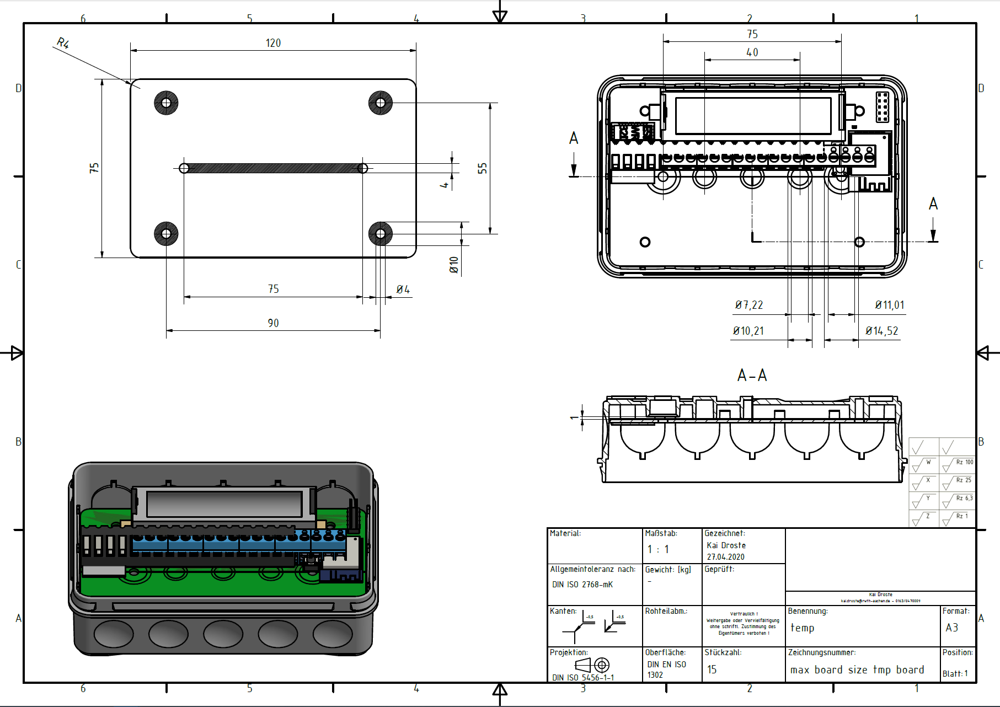

# iot_temp

This repository entails the specifications and PCB design of a gateway communicating with temperature sensors.

**Specifications:**
*  Battery: LiFePo4 18650 cell [lipopower.de](https://shop.lipopower.de/A123-Systems-APR18650M1A-1100mAh)
    * Battery holder: [Datasheet](Datasheet/Keystone_01142020_1042.pdf)
*  Case dimensions: 120 x 75 x 36 mm 
    *  Case Datasheet: [Spelsberg 2K-16](Datasheet/M-346-916-01_V1.pdf)

[Drawing](Datasheet\temp-drawing.pdf)

* ESP32-WROOM-32D
* Header Pins for flashing bridge 
    * [ESP-Prog](https://github.comespressif/esp-iot-solution/blob/master/documentsevaluation_boards/ESP-Prog_guide_en.md)
* Reset Button (EN)
* 2x MAX31865 for 2 RTD-Elements
* TS3A44159PWR Multiplexer for switching between PLC and ESP32
    * [Mouser-Link](https://www.mouser.de/ProductDetail/Texas-Instruments/TS3A44159PWR?qs=sGAEpiMZZMvjbjwkTuU2aTxU6YamLMpeYsaiusRAsW8=)
* Terminal block 18 TB004-508-18BE 
    * [Mouser-Link](https://www.mouser.de/ProductDetail/CUI-Devices/TB004-508-18BE?qs=%2Fha2pyFaduiuF0vDuq7AnN9%2FDe5hgHOKWwquf%252BQh13fOlF3uCj6rv1tKdfXqNkzP)

**IOs:**
1. Lead 1 RTD 1 (from RTD to Gateway) 
2. Lead 2 RTD 1 (from RTD to Gateway)
3. Lead 3 RTD 1 (from RTD to Gateway)
4. Lead 4 RTD 1 (from RTD to Gateway)
5. Lead 1 RTD 2 (from RTD to Gateway)
6. Lead 2 RTD 2 (from RTD to Gateway)
7. Lead 3 RTD 2 (from RTD to Gateway)
8. Lead 4 RTD 2 (from RTD to Gateway)
9. Lead 1 RTD 1 (from RTD forwarding to PLC) 
10. Lead 2 RTD 1 (from RTD forwarding to PLC)
11. Lead 3 RTD 1 (from RTD forwarding to PLC)
12. Lead 4 RTD 1 (from RTD forwarding to PLC)
13. Lead 1 RTD 2 (from RTD forwarding to PLC)
14. Lead 2 RTD 2 (from RTD forwarding to PLC)
15. Lead 3 RTD 2 (from RTD forwarding to PLC)
16. Lead 4 RTD 2 (from RTD forwarding to PLC)
17. GND (input for relais switch from PLC)
18. 24 VDC (input for relais switch from PLC)

## TODO:
- [x] Housing for Battery and Board
	- [x] Measurements
	- [x] Mounting Holes

